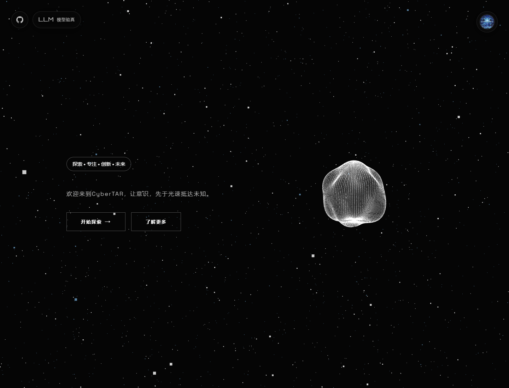

# CyberTAR

CyberTAR 是一个面向 AI、开源、创作与效率探索的静态网站。它把趋势内容、实验工具和个人知识入口组织在一起，用一个沉浸式首页串起项目浏览、论文追踪、工具箱和模型验真等功能。



## 在线访问

- 官网: [https://cybertar.youngood.tech/](https://cybertar.youngood.tech/)
- GitHub Pages: [https://cybertar.github.io/](https://cybertar.github.io/)

## 当前功能

- **沉浸式首页**: 星空背景、动态视觉和清晰入口，作为整个站点的起点。
- **实时热点**: 汇总近期值得关注的技术、AI 与创作信息。
- **Trending Project**: 跟踪 GitHub 与 Hugging Face 的热门项目，支持日榜、周榜、月榜等视图。
- **Trending Papers**: 展示 Hugging Face Papers 趋势论文，支持多种榜单分类。
- **工具箱**: 收纳面向效率、创作和开发的小工具入口。
- **AI Lab 项目集**: 聚合实验原型与可探索页面，包含 Prompt 优化器、SVG/XML 可视化等实验工具。
- **模型验真**: 在浏览器中测试模型接口兼容性与行为表现，默认采用 Responses 协议与 `gpt-5.5`，可生成结构化报告。
- **Blogs**: 博客与随笔入口。
- **沉浸式音频**: AsVox 沉浸式音频体验与 LX Music 在线音乐播放。
- **语音降噪**: 提供语音处理实验页面。
- **RSS 订阅**: 为项目和论文趋势提供可订阅的 Feed。

## 主要页面

- 首页: [`/`](https://cybertar.youngood.tech/)
- 实时热点: [`/focus`](https://cybertar.youngood.tech/focus)
- Trending Project: [`/trending-project`](https://cybertar.youngood.tech/trending-project)
- Trending Papers: [`/huggingface-papers`](https://cybertar.youngood.tech/huggingface-papers)
- 工具箱: [`/tools`](https://cybertar.youngood.tech/tools)
- AI Lab: [`/projects`](https://cybertar.youngood.tech/projects)
- 模型验真: [`/lab/model-verifier`](https://cybertar.youngood.tech/lab/model-verifier)
- Prompt 优化器: [`/lab/prompt-optimizer`](https://cybertar.youngood.tech/lab/prompt-optimizer)
- SVG/XML 可视化: [`/lab/svg-monitor`](https://cybertar.youngood.tech/lab/svg-monitor)
- Blogs: [`/blogs`](https://cybertar.youngood.tech/blogs)
- 沉浸式音频: [`/entertainment`](https://cybertar.youngood.tech/entertainment)
- 在线音乐: [`/entertainment/lx_online`](https://cybertar.youngood.tech/entertainment/lx_online)
- 语音降噪: [`/voice-denoise`](https://cybertar.youngood.tech/voice-denoise)
- Space: [`/space`](https://cybertar.youngood.tech/space)

## RSS

### GitHub Trending

- Daily: [feeds/rss/github-trending-daily.xml](https://cybertar.youngood.tech/feeds/rss/github-trending-daily.xml)
- Weekly: [feeds/rss/github-trending-weekly.xml](https://cybertar.youngood.tech/feeds/rss/github-trending-weekly.xml)
- Monthly: [feeds/rss/github-trending-monthly.xml](https://cybertar.youngood.tech/feeds/rss/github-trending-monthly.xml)

### Hugging Face Models

- Trending: [feeds/rss/huggingface-models-trending.xml](https://cybertar.youngood.tech/feeds/rss/huggingface-models-trending.xml)
- Most Likes: [feeds/rss/huggingface-models-likes.xml](https://cybertar.youngood.tech/feeds/rss/huggingface-models-likes.xml)
- Most Downloads: [feeds/rss/huggingface-models-downloads.xml](https://cybertar.youngood.tech/feeds/rss/huggingface-models-downloads.xml)

### Hugging Face Papers

- Daily: [feeds/rss/huggingface-papers-daily.xml](https://cybertar.youngood.tech/feeds/rss/huggingface-papers-daily.xml)
- Weekly: [feeds/rss/huggingface-papers-weekly.xml](https://cybertar.youngood.tech/feeds/rss/huggingface-papers-weekly.xml)
- Monthly: [feeds/rss/huggingface-papers-monthly.xml](https://cybertar.youngood.tech/feeds/rss/huggingface-papers-monthly.xml)
- Trending: [feeds/rss/huggingface-papers-trending.xml](https://cybertar.youngood.tech/feeds/rss/huggingface-papers-trending.xml)

## 本地预览

```bash
python -m http.server 4180
```

然后访问:

```text
http://127.0.0.1:4180/
```

如需生成 clean URLs 版本:

```bash
npm install
npm run build
```

构建结果输出到 `_site/`。

## 目录结构

- `index.html` — 沉浸式首页（站点根 `/`）。
- `pages/` — 二级页面（focus、tools、space、trending-project、huggingface-papers、projects、project-view、voice-denoise）。
- `assets/` — 共享前端资源（`script.js`、`styles.css`）。
- `scripts/` — 数据抓取、Feed 生成、clean URLs 构建及管理脚本（`manage.sh`、`generateProjectList.js`）。
- `lab/` — 实验页面（模型验真、Prompt Optimizer、SVG Monitor 等）。
- `feeds/`、`images/`、`blogs/`、`knowsnews/`、`entertainment/`、`projects/`、`workers/` — 数据、媒体与子站点资源。

> 页面的公开地址由 `scripts/build-clean-urls.js` 显式定义（如 `/focus/`、`/tools/`），与源文件所在目录无关；调整源文件位置不会改变线上 URL。

## 维护说明

- 首页截图位于 [`images/website_p.png`](./images/website_p.png)。
- 趋势数据和 RSS Feed 由 `scripts/` 下的脚本生成。
- 实验页面主要位于 `lab/`，二级页面位于 `pages/`，项目集位于 `projects/`。
- 统一管理脚本现为 `./scripts/manage.sh`（自动切换到仓库根目录运行）。

## 许可证

本项目采用 [MIT License](./LICENSE)。

## Reference

Powered by [ASSTAR](https://github.com/ASSTAR-X/ASSTAR-X.github.io)
